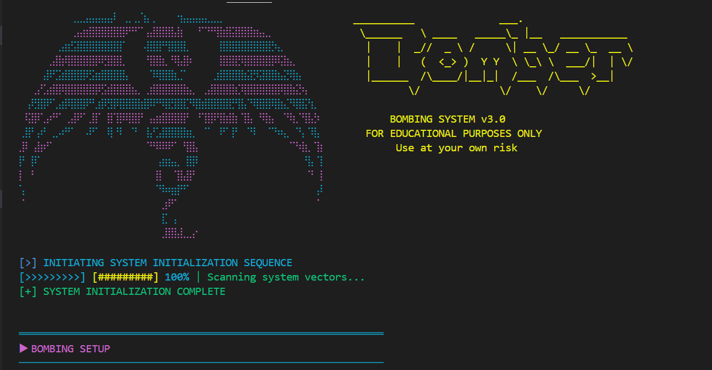
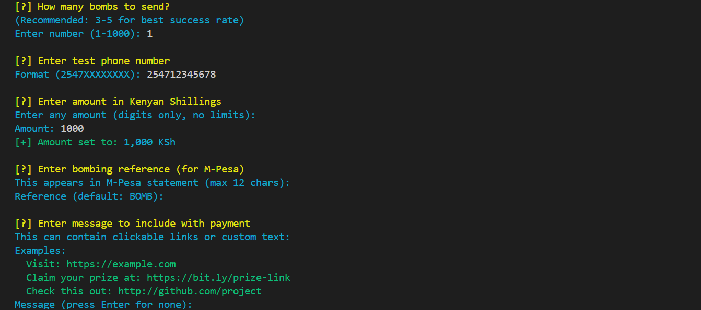
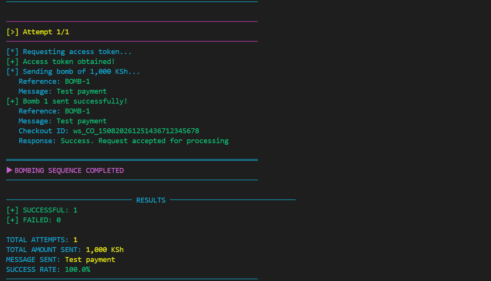

# TerminalBomber v3.0

<div align="center">
  
  
  
  
</div>

---








##  **LEGAL DISCLAIMER**

> **THIS TOOL IS FOR EDUCATIONAL AND TESTING PURPOSES ONLY!**
>
> - ✅ **NO REAL MONEY** is transferred not unless configured otherwise
> - ✅ For learning only
> - ❌ **DO NOT** use for illegal activities
> - ❌ **DO NOT** harass or spam anyone
>
> **By using this tool, you agree that:**
> 1. You will use it ONLY for educational/testing purposes
> 2. You will NOT use it for any illegal activities
> 3. You accept FULL responsibility for your actions
> 4. The developer is NOT responsible for misuse

---

##  **About**

A powerful terminal bomb testing tool with an immersive cyber-themed interface. Built for educational purposes.

###  **Features**

-  **Beautiful ASCII Art Banner** - Cyber/dragon themed
-  **Bulk Testing** - Send 1-1000 test requests
-  **Smart Rate Handling** - Automatic delay adjustment
-  **Consecutive Failure Detection** - Intelligent retry logic
-  **Real-time Statistics** - Success rate tracking
-  **Transaction Logging** - SQLite database storage
-  **Clickable URL Support** - Include links in messages (this is not currently working)
-  **Colored Output** - Enhanced terminal experience
-  **User Agent Rotation** - Avoid detection


---

##  **Table of Contents**

- [Installation](#-installation)


---

##  **Installation**

### **Prerequisites**
- Python 3.8 or higher
- Pip package manager
- Internet connection

### **Option 1: Quick Install (Recommended)**

```bash
# Clone the repository
git clone https://github.com/illusive7ai/terminalbomber.git
cd terminalbomber

# Run the script - it auto-installs dependencies!
python terminalbomber.py
